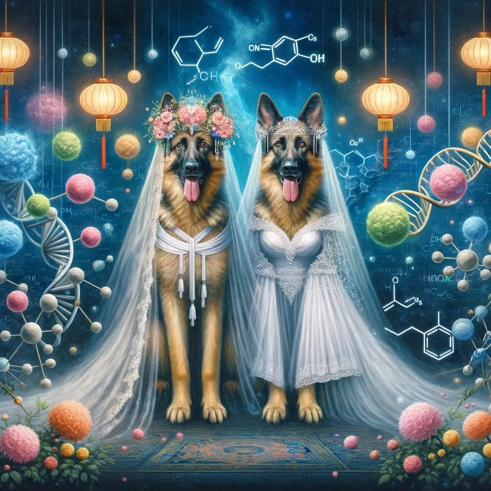

熟悉当代仙侠文学的朋友们都了解仙人们其实也像我们凡人一样恋爱结婚的。只不过他们双方不叫“爱人”，而称为“道侣”。同时，仙人们的道侣往往也是境界相近的仙人，同时仙人们的婚姻往往很长久（数百年到数千年不等)，仙人们的结合也没有世俗世界中离婚之说。

现代生物化学向我们展示了如下人类对于爱情和婚姻的化学根源是这样理解的。**初恋**：苯乙胺浓度逐渐升高，双方试图了解对方、试探性投入（约会），如果认可对方的回应便可继续发展。**热恋**：苯乙胺、多巴胺、去甲肾上腺素大量释放，双方对对方产生思念，神经活动制造心理时间膨胀（一日不见如隔三秋），催产素多倍上升导致内在化：追求“心有灵犀一点通（三观契合）”。**婚后**（热恋期后）苯乙胺退出，激情便开始消退。大脑会觉得这事不过如此、没什么意思，情感切换为占有欲、排他性。通常，苯乙胺持续为一个人工作的时间在 2~3 年之内。人类学家海伦·费希尔考察认为结婚 4 年左右的离婚率是最高的，3 年没孩子可以导致感情降低 30%~50%。

这样来说，仙人们的婚姻能够一直维持几千年，他们的生物化学机制就一定与人类不同，能够一直分泌热恋期的化学物质。这样的生物化学机制将使他们能够在几千年的长寿命中保持持久的激情和深厚的情感联系。

多巴胺化可以产生表观遗传修饰。通过与 H3 组蛋白结合，5-羟色胺和多巴胺可以调节 DNA 向 RNA 的转录，从而调节特定蛋白的合成。这意味着多巴胺不但能通过突触传递信号，还可以进入细胞核并**控制特定基因**。此事实颠覆了人们对遗传学和吸毒成瘾的理解，你也可以由此联系到“热恋”之类的。酒精和可卡因等成瘾性药物的强烈渴望有一部分原因是组成相关电路的细胞的基因被修整。在大鼠和人类之中，服用可卡因可以导致腹侧被盖区神经元的 H3 多巴胺化程度降低。持续一个月不吸，多巴胺化幅度会反弹到超过平时，引起强烈的戒断反应。归根结底，**针对人类的生物化学的调节机制所对应的状态确实不能一直持续，那是基因决定的机制**。但是，对于仙人们来说这个基因机制会一直延续几千年。这样就有两个可能：**基因改变（这个有待取得仙人基因样本后进一步分析）**：在仙侠小说的世界中，仙人通过修炼可能改变了他们的基因结构，使得他们的生物化学机制与普通人类有所不同。这种改变可能使得仙人能够持续分泌与“热恋”阶段相关的激素，从而维持长久的情感状态。这样的改变可能涉及到神经递质的合成、释放、再摄取机制的改变，甚至可能影响到神经细胞核内基因的表达方式。**成瘾性分泌**：另一种可能是，仙人虽然保持了与人类相似的基因特性，但由于修炼使得身体更加强壮，他们的神经系统可能适应了持续分泌与“热恋”相关激素的成瘾性状态。这意味着仙人的生物化学反应机制可能经过了特殊的调整，使得他们能够在长时间内维持情感的高潮状态。

**但是成瘾性与不可持续往往是相互关联的**。我是不是可以大胆推测，仙人们的死亡，就是道崩是因为自身改造过的基因无法继续承受成瘾性带来的后果或者伤害？而每一位仙人的境界不同，其实也就是这种承受力不同？

假设仙人通过修炼或其他手段改造了自己的基因，以持续产生类似于“热恋”阶段的生物化学物质。随着时间的推移，这种改造可能导致了身体和精神上的负担，最终导致了所谓的“道崩”，即仙人的身体和精神无法承受持续的生物化学压力而崩溃。

仙人通常有不同的修炼境界，这些境界可能反映了他们对于自身改造和生物化学压力的承受能力。高境界的仙人可能更能有效地管理和调节这种压力，从而维持更长久的生命和力量。

说到这里，我是不是已经泄露了天机？

实在是编不下去了。