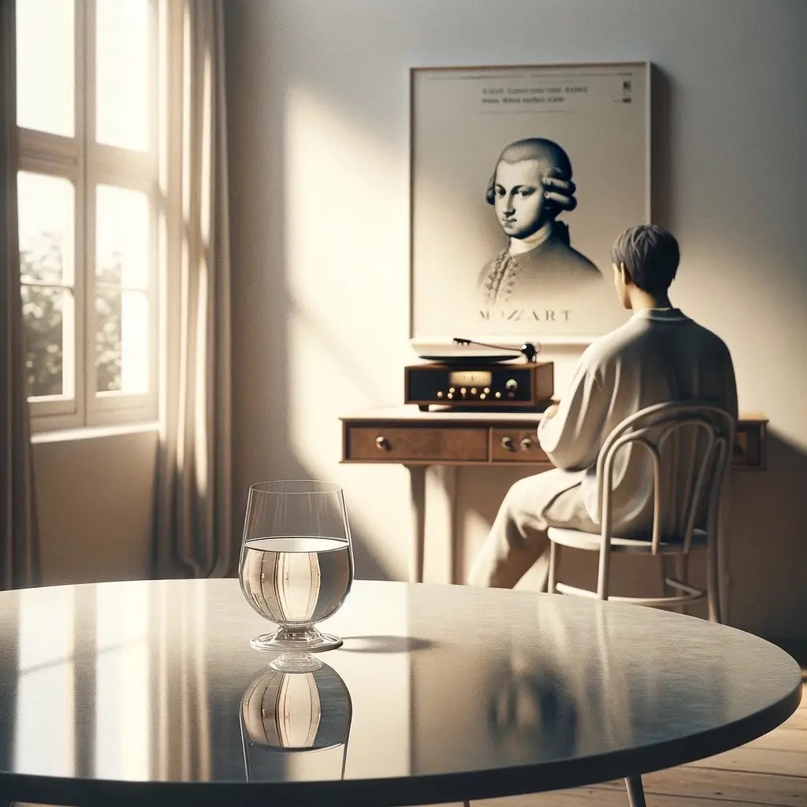

别笑！

这个说法，虽然听起来可能有些匪夷所思，其实却有其独特的对生命内涵的理解。这不仅是一种生活方式的提议，更是一种对日常简约之美与艺术高雅之美相结合的追求。

从文化的角度来看，白开水作为最基本的饮品，代表了生活的简单和纯粹。在许多文化中，水不仅仅是生存的基础，也象征着清洁、更新和生命的力量。在快节奏、充满各种复杂选择的现代生活中，选择喝白开水反映了一种回归自然、追求简单和本质的生活态度。

莫扎特的音乐，以其清晰的旋律线条、和谐的和声及精巧的结构而著称，是西方古典音乐的典范。莫扎特能够在复杂的音乐结构中表达出流畅和自然的美感，这种美感不仅仅是听觉的享受，更触及了人们内心深处对于美好和谐的向往。

“喝白开水加莫扎特”，其实是一种生活行为艺术的实践。就像白开水的简单纯净与莫扎特音乐的高雅和谐一样，两者都在各自的领域中追求极致的纯粹和美好。这种结合提醒我们，在日常生活的平凡之中，也可以寻找和创造美的体验。通过将莫扎特的音乐融入喝水这一最基本的日常活动中，我们不仅提升了生活的质感，也在无形中培养了对美的感知和欣赏。

此外，这种做法也反映了一种跨领域的审美体验。古典音乐与生活哲学相结合，展现了不同文化元素之间的对话和融合，促进了生命体的和谐统一。

这种将简约生活与艺术美感相结合的生活态度。它提醒我们，在日常生活的每一个简单动作中，都有机会体验到艺术的美好，从而丰富我们的生活和精神世界。