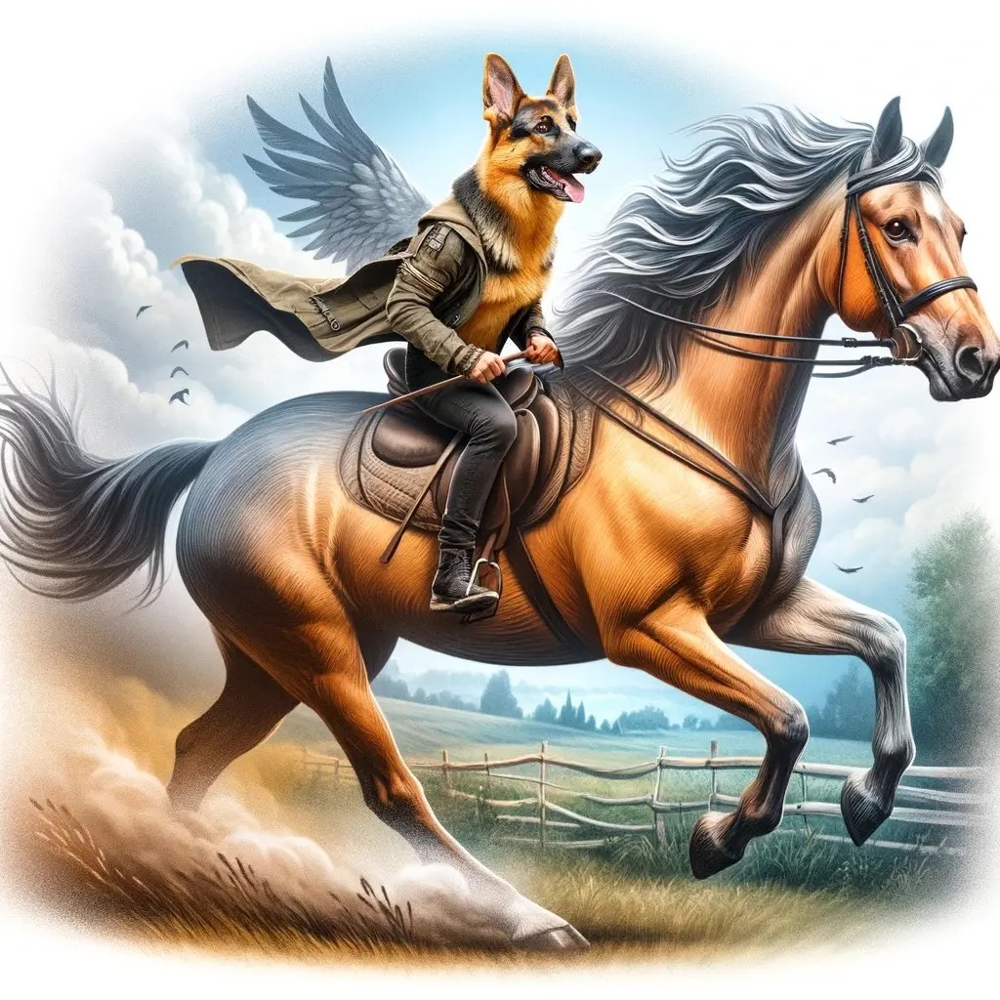

送小宝上数学课的路上，小宝问：新闻上说这几年护士的招生增加了，是不是代表着今后看病会更少排队？

于是我们讨论了社会问题往往取决于不止一个因素的作用，同时所有的影响因素中存在着主要因素和次要因素。

接下来我们又将这个理论引申到分析战争上面，两军作战，哪个是胜利的决定因素呢？数量，武器，士气？

小宝突然表示：他以前都认为数量和武器决定了胜利，直到读了Percy Jackson之后，意识到了“爱”与“战争”的关系。人们可以为了“爱”和“信念”发挥出全部能力去赢得战争胜利，他同时还使用Star war中的例子给予辅助说明。

这表明文学作品不仅仅是故事的叙述，更是情感教育和价值观塑造的重要途径。

文学作品通过丰富的情节和鲜活的人物形象，展现了复杂的人际关系和丰富的情感世界，帮助孩子们理解和表达自己的情感。同时，通过故事中人物的抉择和行为，文学作品传达了勇气、正义、爱、牺牲等核心价值观，引导孩子们思考什么是对的，什么是错的。这种情感教育和价值观塑造的功能，是文学作品独特的魅力所在。

太史公曰：文籍于童蒙之际，岂但游戏之物哉？其所以启智开思，丰富心灵，塑造崇高道德观与广阔世界观者也。读之，则能悟他心，知勇于逆境，学以爱与信念为战斗之本。此文学之独到教化，非他途所能及也。

吾等宜勉之，勿使其荒废，以免贻误莘莘学子之未来。文学，非徒娱乐之物，亦道德之源、智慧之泉也。故父母师长，当引导之以恰，使其早日领略文学之真谛，成就一代明德。