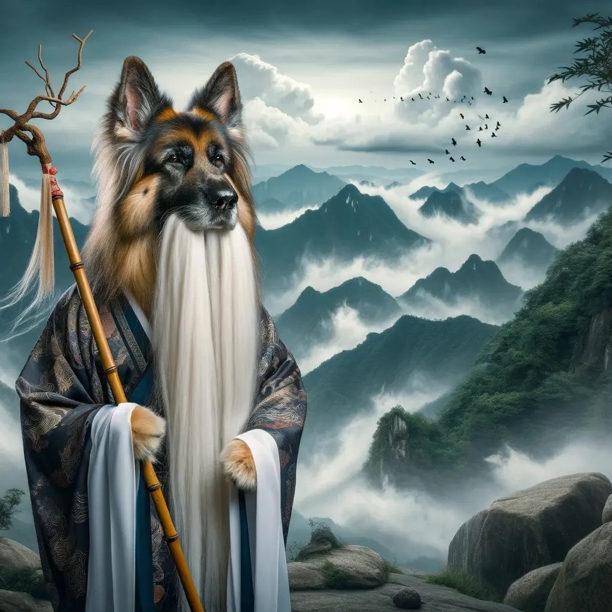

当代仙魔小说中常见的手法经常将来自远古时代的人物、器物、功法描述为最强大，最高明。成年人都知道并不是这么回事，但读多了可能会无形中受到这个观念影响。我本人称这种写作模式为“尊古”。很多名著中也都有使用。比如说：封神演义，红楼梦，甚至外国文学作品如魔戒，亚瑟王的传说等。

但是，在大量的通俗读物中充斥的“尊古”现象，其社会影响却远远超出文学本身的艺术表现需要，已经对社会产生了潜移默化的触动。

尊古，代表着崇尚传统，以不变为好。而今这个快速发展的时代，传统文化不断受到现代化的挤压，与现代化之间的张力不断显现。

尽管中华文化深深植根于传统的尊重之中，但随着社会的进步和变迁，许多传统观念和实践需要被重新审视和调整。与此同时，文学作品中流行的尊古风气可能在不经意间强化了对传统的盲目崇拜，从而对现代社会观念和发展产生复杂的影响。

在现代社会中，传统往往与创新、变革和进步的需求相冲突。尊重和保护传统文化是必要的，但同时也需要批判性地审视传统，筛选那些促进社会发展和符合现代价值观的元素。

文学作品中的尊古手法，虽然能够传达对历史与文化的尊重，但也可能导致读者对传统的盲目崇拜和固守。这种情况下，文学不再是对话和反思的工具，而是成为传统不合理部分的传声筒。

在现代社会，传统的重构和创新是不可避免的。文学作品应当成为这一进程的积极参与者，通过对传统的批判性展现和重新解读，引导读者理性地看待过去，并从中汲取对当下和未来有价值的启示。

文学作品作为文化传承的重要载体，其在传达传统价值观时应当更加审慎和前瞻。在尊古的同时，作品更应着眼于传统与现代的对话，促进文化的创新和发展。

