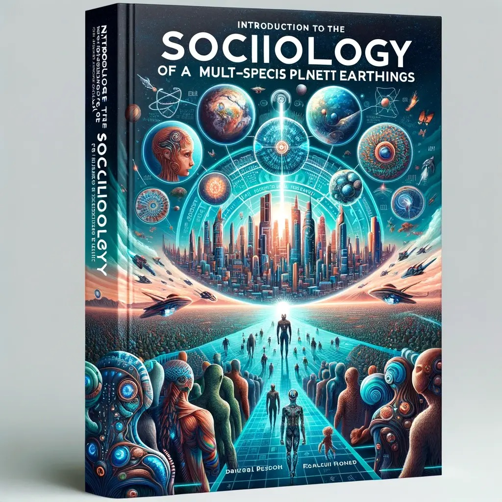

#引言
**本文为纯学术范畴的讨论，猎奇请避退。**
人类作为地球上唯一的智慧生命，形成了地球上独特的社会形态。同时人类社会经历了数千年的发展与变革，积累了丰富的社会学知识和理论。有朝一日，人类如果踏入宇宙中，发现了另一个由多个不同的智慧生物共同生活的世界，我们怎样使用已有的知识和预设，来分析和认识新世界的社会呢？

大家可能都看过《星球大战》系列的小说和影视作品，里面设定了一个多种智慧生命相处的宇宙。一个拥有多个智慧物种共同生存的星球的社会，与地球上以人类为唯一智慧物种的社会，可能存在许多异同之处。这些差异和相似之处可以从社会结构、文化、政治和经济等多个方面进行探讨：

### 相似之处
1. **基本社会需求**：
   - 无论是地球还是多物种星球，所有智慧生物可能都有基本的社会需求，如生存、安全、归属、尊重、自我实现等。这可能会导致一些共同的基本功能，例如组织、制度、规范、交流、合作等。这个星球的社会可能会有一些共同的基本问题，因为不同的智慧物种可能会面临一些共同的基本问题，例如资源、环境、发展、和平、公正等，这可能会导致一些共同的基本解决方案，例如科技、教育、法律、政治、道德等。
   - 社会结构可能围绕满足这些基本需求而形成，如家庭、社区和社会组织。
2. **文化发展**：
   - 文化在任何智慧物种中都可能发展，包括艺术、音乐、文学和宗教等形式。
   - 不同的文化可能表达对生活、宇宙和存在的理解和态度有所不同。
3. **经济交换**：
   - 经济活动和资源交换是大多数社会的基础。无论是地球还是其他星球，可能都会形成某种形式的经济系统来分配资源和服务。
4. **政治组织**：
   - 政治结构用于管理社会事务，可能在任何智慧物种中都存在。这可能包括权力的分配、决策过程和法律制度。

### 差异之处
1. **种族多样性和适应性**：
   - 在多物种星球上，社会适应性和灵活性可能远超地球，因为需要适应不同物种的生理和心理特点。
   - 种族间的差异可能导致更复杂的社会结构和更高度的文化多样性。
2. **沟通方式**：
   - 不同智慧物种可能拥有不同的沟通方式，这可能包括语言、肢体语言或其他感官交流方式。
   - 这对于促进不同物种间的理解和协作提出了挑战。
3. **物种关系和冲突**：
   - 不同物种间的相互作用可能比地球上的人类内部相互作用更复杂。这可能包括合作、竞争、冲突和共生等多种关系。
   - 物种关系可能是社会政治和经济讨论的核心议题。
4. **法律和伦理体系**：
   - 法律和伦理体系可能需要考虑多物种的不同需求和权利，这可能比地球上的单一物种社会更为复杂。
   - 需要解决的问题可能包括物种间的权利和义务、资源共享和环境保护等。
5. **技术和科学发展**：
   - 不同智慧物种可能在技术和科学上有不同的贡献，这可能导致科技发展的多样化路径。
   - 技术和科学可能更加注重跨物种的可用性和适应性。

#新的挑战
市面上已经有很多文献讨论过多智慧物种见的关系和协作等等，相关的认识也早已反应到不同的文学作品和影视动画作品，甚至电子游戏的设定之中。而本文的主要目的是为了将传统的社会学理论尝试进行应用，故此将在已有的设定之上，引入新的“变量”，来进行全新的尝试。
我们来讨论：**这是一个存在多个智慧物种的星球。每一个智慧物种在一生中都有机会变成其它智慧物种。如果这种转变是可选择的或者是随机的，会有什么不同的表现呢？这两种不同的转变方式会对这个世界的历史，文化，宗教，社会产生哪些不同的影响？**
**首先，我们假设这个星球上有n种智慧物种，它们都有相似的智力水平和生理结构，但有不同的外貌和特征。我们也假设这些物种之间可以和平共处，没有战争或暴力冲突。我们还假设这些物种都有一定的文化和宗教信仰，但没有统一的世界观或价值观。**
## 可选择的转变
###社会结构和阶级系统的影响（基于社会分层理论）
根据社会分层理论，个体可以根据自己的意愿和社会地位选择转变，可能导致社会阶层和权力结构固化或变化。可选择的转变能力在这个星球上可能成为决定个体社会地位和身份的重要因素，影响着社会结构和阶层的形成和演变。**社会分层理论**探讨了社会中不同群体之间的不平等关系，这些关系通常基于财富、权力、地位等因素。社会地位往往与个人拥有的资源和机会相关联。
**转变的选择与资源分配**：在这个星球上，能够选择转变成为另一种智慧物种，如果需要某种自然资源辅助的话（某一种矿物，或者植物）。这些自然资源可能最终被某个阶层垄断而成为一种独特资源。
**转变与社会地位的关联**：在已经固化的社会阶层结构下，如果某些转变被视为更有价值或更受欢迎，进行这些转变的个体可能获得更高的社会地位。相反，如果某些转变被视为不利或不受欢迎，进行这些转变的个体可能会遭遇社会地位的下降。
**转变的选择与个人身份**：个体的转变选择反映了他们的个人愿望、价值观和身份。在社会中，这种选择可能被视为个人特征的重要表现，影响着他们的社会认同和群体归属感。
**权力结构的变化**：能够控制或影响转变选择的个体或群体可能获得额外的权力，因为他们可以决定（由外力）谁能够获得某种物种的特性。这种控制可能导致新的权力结构出现，围绕着转变的能力和选择而形成。
**阶层固化或变化的可能性**：如果转变的选择受到严格的社会控制，这可能导致现有的社会阶层和权力结构固化。相反，如果转变的选择相对自由，这可能导致更多的社会流动性和阶层结构的变化。
我们可以通过一些具体的假设来举例分析：首先，我们可以假设这个星球上的社会分层是基于以下三个标准的，这些标准是韦伯提出的社会分层的三个维度。
**财富**：指个体或群体在经济市场中的生活机会，包括收入，财产，消费能力等。**权力**：指个体或群体在社会关系中实现自己意志的可能性，包括政治，法律，军事，管理等方面的影响力和控制力。**声望**：指个体或群体在社会环境中获得的声誉和尊敬，包括文化，教育，职业，身份等方面的认可和评价。
根据这三个标准，我们可以假设这个星球上的社会分层大致如下：**财富阶层**：根据个体或群体的经济资源和市场地位，分为富裕阶层，中产阶层，贫困阶层等。
**权力阶层**：根据个体或群体的政治资源和社会地位，分为统治阶层，精英阶层，平民阶层等。**声望阶层**：根据个体或群体的文化资源和社会地位，分为名望阶层，专业阶层，普通阶层等。
当然，这些阶层并不是完全分离和对立的，而是相互联系和影响的，有时也可以互相转化的。例如，一个富裕的个体或群体可能也有较高的权力和声望，或者通过财富来获取权力和声望，反之亦然。
那么，如果这个星球上的个体或群体可以选择变成其他智慧物种，这会对社会分层有什么影响呢？我认为，这取决于以下几个因素：**转变的动机**：个体或群体为什么要选择变成其他智慧物种？是出于个人偏好，社会压力，文化或宗教因素，还是其他原因？不同的动机可能会导致不同的转变结果和影响。**转变的条件**：个体或群体要选择变成其他智慧物种，需要满足什么条件？是需要支付一定的代价，获得一定的许可，遵循一定的规则，还是其他条件？不同的条件可能会影响转变的难易程度和范围。**转变的效果**：个体或群体选择变成其他智慧物种，会带来什么效果？是会改变自己的财富，权力，声望等社会资源，还是只会改变自己的外貌和特征？不同的效果可能会影响转变的意义和价值。
根据这些因素，我们可以做一些可能的分析和推测，例如：如果个体或群体选择变成其他智慧物种，是出于个人偏好，例如喜欢某种物种的外貌或特征，或者认为某种物种更适合自己的性格或兴趣，那么这种转变可能不会对社会分层有太大的影响，只是表现了个体或群体的多样性和个性化。这种转变可能不需要太多的条件，也不会带来太多的效果，只是改变了自己的外貌和特征，而不会改变自己的社会资源和地位；如果个体或群体选择变成其他智慧物种，是出于社会压力，例如受到周围人的影响或期望，选择变成某种物种以获得认同或尊重，那么这种转变可能会对社会分层有一定的影响，表现了个体或群体的适应性和从众性。这种转变可能需要一定的条件，例如需要获得周围人的同意或支持，也可能会带来一定的效果，例如改变了自己的声望或权力，但不一定会改变自己的财富；如果个体或群体选择变成其他智慧物种，是出于文化或宗教因素，例如受到自己的文化或宗教信仰的指导，选择变成某种物种以符合某种理念或目标，那么这种转变可能会对社会分层有较大的影响，表现了个体或群体的信念性和价值性。这种转变可能需要较多的条件，例如需要遵循一定的规则或仪式，也可能会带来较多的效果，例如改变了自己的财富，权力，声望等社会资源，甚至改变了自己的社会阶层。
综上所述，我们可以得出以下结论：**转变的选择**：个体或群体选择变成其他智慧物种，可能成为社会地位和个人身份的重要部分。这是因为，转变的选择可能会反映个体或群体的偏好，压力，信仰，目标等，从而影响他们在社会中的认同和归属感，以及他们与其他个体或群体的关系和互动。例如，如果个体或群体选择变成其他智慧物种，是为了表达自己的个性或多样性，那么他们可能会更加自信或自豪，也可能会更加开放或包容；如果个体或群体选择变成其他智慧物种，是为了适应或融入某种社会或文化，那么他们可能会更加顺从或忠诚，也可能会更加保守或排他。
##文化发展（基于文化相对主义）
文化可能发展出一套围绕选择转变的传统和习俗。艺术和文学可能会强调个人选择的重要性，反映身份和转变的主题。基于文化相对主义的原则，可选择转变的社会可能会发展出一套新的文化传统和习俗，并在艺术和文学中强调个人选择和身份转变的主题。
**文化相对主义**是一种观点，认为文化是由社会环境和历史背景塑造的，并且每种文化都有其独特的价值体系和行为规范。根据这一理论，文化是流动的、适应性的，能够响应社会变化。
**转变作为文化要素**：在这个设定中，转变成为不同智慧物种是一种独特的现象，对社会成员的生活产生深远影响。由此，转变成为文化中的一个核心要素，影响着人们的价值观、信仰和日常行为。**发展出传统和习俗**：社会会围绕重要的文化要素发展出相关的传统和习俗。在这种情况下，围绕选择转变的仪式、庆祝活动和社会习惯可能会形成。这些传统和习俗可能包括准备转变的过程、庆祝转变的节日，以及围绕转变的社会规范。**艺术和文学的反映**：艺术和文学通常反映并探索社会的核心主题和关注点。在这个社会中，个人选择转变的重要性和对身份的影响可能成为艺术和文学创作的重要主题。作家和艺术家可能通过作品探讨转变对个人和社会的意义，反映身份变化的经历和情感。**个人选择的重视**：在可选择转变的文化中，个人的选择成为决定自我身份和命运的关键。因此，强调个人选择的重要性可能会渗透到文化的各个方面，从艺术表达到日常生活的实践。**身份和转变的主题**：身份的流动性和变化可能成为文化探讨的重点，反映在文化制品和社会对话中。这可能导致一种文化氛围，其中个体被鼓励探索和表达自己的身份，以及他们在不同生命阶段的转变经历。
我们可以通过一些具体的假设来举例分析：首先，我们可以假设这个星球上的文化是基于以下两个标准的，这些标准是文化相对主义的核心观点。**文化是相对的**：指不同的文化具有不同的信仰，习俗，道德，价值等，不应该借由其他的文化观点来判断；只有从该文化本身的标准和价值出发，才能够了解和评价该文化。**文化是多样的**：指世界上存在着多种不同的文化，每一种文化都是人类存在的同等的合法表达，不同的文化并无优劣高低之分，应该尊重和保护文化的多样性。
根据这两个标准，我们可以假设这个星球上的文化发展大致如下：**文化的传统和习俗**：根据不同的智慧物种的特征和偏好，以及不同的转变动机，条件，效果，文化可能发展出一套围绕选择转变的传统和习俗，例如：**转变的仪式**：为了庆祝或纪念个体或群体的转变，文化可能会制定一些仪式，例如祈祷，祝福，赞美，赠送，分享等，以表达对转变者的尊重，支持，欢迎，祝福等。**转变的礼仪**：为了规范或协调个体或群体的转变，文化可能会制定一些礼仪，例如申请，通知，同意，确认，感谢等，以表达对转变者的理解，关心，信任，尊重，友好等。**转变的象征**：为了标识或展示个体或群体的转变，文化可能会制定一些象征，例如服饰，饰品，纹身，标志，名称等，以表达对转变者的认同，归属，荣誉，个性，价值等。**文化的艺术和文学**：根据不同的智慧物种的特征和偏好，以及不同的转变动机，条件，效果，文化可能会强调个人选择的重要性，反映身份和转变的主题，例如：**转变的创作**：为了表达或传达个体或群体的转变，文化可能会创作一些艺术和文学作品，例如画作，雕塑，音乐，诗歌，故事，戏剧等，以展示转变者的想法，情感，经历，梦想，目标等。**转变的欣赏**：为了理解或感受个体或群体的转变，文化可能会欣赏一些艺术和文学作品，例如观看，聆听，阅读，评论，赞美，批评，推荐等，以分享转变者的观点，感受，启示，教训，启发等。**转变的交流**：为了沟通或互动个体或群体的转变，文化可能会交流一些艺术和文学作品，例如展示，演出，讲述，对话，讨论，辩论，合作等，以建立转变者的联系，关系，友谊，合作，竞争等。
综上所述，我们可以得出以下结论：文化可能发展出一套围绕选择转变的传统和习俗。这是因为，不同的智慧物种和不同的转变情况，可能会影响文化的标准和价值，从而影响文化的形式和内容。文化的传统和习俗是文化的外在表现，反映了文化的规范和功能。艺术和文学可能会强调个人选择的重要性，反映身份和转变的主题。这是因为，不同的智慧物种和不同的转变情况，可能会影响文化的特征和偏好，从而影响文化的创造和欣赏。文化的艺术和文学是文化的内在表现，反映了文化的意义和价值。
##宗教和信仰体系（基于宗教社会学）
宗教可能围绕选择的自由和个人决策的道德含义发展。可能出现新的宗教运动，将转变视为灵魂成长或试炼的一部分。基于宗教社会学的原则，可选择转变的社会可能导致宗教和信仰体系围绕选择的自由、个人决策的道德含义以及灵魂成长发展新的教义和运动。
**宗教社会学**研究宗教如何影响和被社会影响，特别是宗教如何解释和应对社会变化。宗教通常提供一套道德框架，帮助信徒理解和导航人生中的重大事件和决策。
**转变作为重大人生事件**：在这个社会中，个体有能力选择变成另一个智慧物种，这被视为一项重大的人生决策和事件。因此，宗教可能发展出解释和指导这种转变过程的教义和信仰。**选择的自由与道德含义**：宗教可能会围绕个体进行这种转变选择的自由和道德含义进行教义发展。这可能包括对选择的责任、个人转变对社会和家庭的影响，以及选择如何反映个人的道德和精神价值观的讨论。**转变作为灵魂成长的路径**：宗教运动可能提倡转变作为个人灵魂成长和发展的一部分，强调在不同物种身份间转变的经验能夠加深个人的精神和自我认识。这样的教义可能强调内在的成长和变化，将转变视为探索个人潜能和理解更广泛宇宙真理的手段。**社会和宗教的互动**：宗教和信仰体系对转变的解释和教义可能反过来影响社会对转变的看法和实践。宗教可能成为支持或引导个人在转变过程中作出道德和精神选择的重要力量。
我们可以通过一些具体的假设来举例分析：首先，我们可以假设这个星球上的宗教是基于以下两个标准的，这些标准是宗教社会学的主要关注点。**宗教是社会的产物**：指宗教是由社会中的不同个体或群体创造和维持的，宗教反映了社会的价值，规范，利益，冲突等，宗教也受到社会的影响和变化。**宗教是社会的功能**：指宗教对社会中的不同个体或群体有不同的作用和意义，宗教可以满足人们的心理，道德，情感，精神等需要，宗教也可以促进或阻碍社会的整合，稳定，变革等。
根据这两个标准，我们可以假设这个星球上的宗教和信仰体系大致如下：**宗教的多元和相对**：根据不同的智慧物种的特征和偏好，以及不同的转变动机，条件，效果，宗教可能会呈现出多元和相对的特点，例如：**多元的神灵观**：不同的智慧物种可能会信仰不同的神灵，或者认为同一神灵有不同的形象和属性，或者认为神灵是多元的，可以变化的，或者认为神灵是单一的，不变的。**多元的救赎观**：不同的智慧物种可能会有不同的救赎目标，或者认为救赎是个人的，自由的，或者认为救赎是集体的，规定的，或者认为救赎是现世的，实际的，或者认为救赎是来世的，理想的。**多元的道德观**：不同的智慧物种可能会有不同的道德标准，或者认为道德是绝对的，普遍的，或者认为道德是相对的，特殊的，或者认为道德是内在的，自然的，或者认为道德是外在的，人为的。**宗教的自由和个人**：根据不同的智慧物种的特征和偏好，以及不同的转变动机，条件，效果，宗教可能会围绕选择的自由和个人决策的道德含义发展，例如：**自由的信仰选择**：个体或群体可以根据自己的意愿和社会地位选择信仰或不信仰某种宗教，或者选择信仰或不信仰某种神灵，或者选择信仰或不信仰某种教义，或者选择信仰或不信仰某种教派。**自由的转变选择**：个体或群体可以根据自己的意愿和社会地位选择转变或不转变成其他智慧物种，或者选择转变或不转变成某种智慧物种，或者选择转变或不转变成某种神灵，或者选择转变或不转变成某种救赎。**个人的信仰决策**：个体或群体可以根据自己的信仰或不信仰来决定自己的行为或不行为，或者决定自己的价值或不价值，或者决定自己的责任或不责任，或者决定自己的幸福或不幸福。**个人的转变决策**：个体或群体可以根据自己的转变或不转变来决定自己的身份或不身份，或者决定自己的归属或不归属，或者决定自己的意义或不意义，或者决定自己的成长或不成长。
综上所述，我们可以得出以下结论：宗教可能围绕选择的自由和个人决策的道德含义发展。这是因为，不同的智慧物种和不同的转变情况，可能会影响宗教的产生和功能，从而影响宗教的多元和相对，以及宗教的自由和个人。宗教的多元和相对可能会导致宗教的竞争和冲突，或者宗教的合作和融合；宗教的自由和个人可能会导致宗教的创新和变革，或者宗教的保守和固化。可能出现新的宗教运动，将转变视为灵魂成长或试炼的一部分。这是因为，不同的智慧物种和不同的转变情况，可能会激发一些新的宗教需求和意义，从而促使一些个体或群体创造和传播一些新的宗教观念和实践。新的宗教运动可能会将转变视为一种灵魂的成长，认为转变是一种提升自己的精神层次和接近神灵的方式；或者将转变视为一种灵魂的试炼，认为转变是一种考验自己的信仰坚定和超越苦难的方式。
##社会动力学（基于社会变迁理论）
可选择的转变可能导致社会不断演变，因为个体可以根据环境或个人愿望调整自己的物种特性。基于社会变迁理论，可选择的转变能力可能导致社会不断演变，因为个体能够根据环境或个人愿望调整自己的物种特性，从而影响社会结构、功能和动力学。
**社会变迁理论**探讨了社会随时间变化的过程，强调技术、经济、政治、文化因素对社会结构和行为的影响。社会变化通常被视为由内部和外部因素驱动，包括技术创新、文化变革、环境变化等。
**转变能力作为社会变化的催化剂**：在这个设定中，个体能够选择变成不同智慧物种的能力本身就是一种强大的社会变化因素。这种能力使得社会中的个体可以根据自身的需求、愿望或环境压力调整自己的生物特性和社会角色。**个体选择与社会适应**：个体根据环境或个人愿望做出的转变选择会影响他们的社会功能和互动方式。这种个体层面的适应和变化可能导致社会整体的结构和动力学发生变化，例如职业分布、社区结构、甚至社会规范和价值观。**环境因素与社会响应**：如果环境变化或社会挑战促使个体进行转变，这将导致社会必须适应这些新的种族特性和能力。社会可能发展出新的制度、政策和文化实践来应对这些变化，如教育系统、职业培训、法律框架等。**社会动力学的不断演变**：由于个体不断根据环境和个人愿望进行种族转变，社会动力学会持续变化，反映出这种持续的个体和集体适应过程。社会结构可能变得更加流动和多元，随着新的种族能力和特性的出现，社会角色和互动模式可能不断发展和变化。
在社会科学中，"**动力学"（Dynamics）**一词通常指的是系统内部的力量、过程和变化机制，特别是这些因素如何随时间推移而产生影响和变化。在社会动力学的背景下，它特别关注社会系统内部如何运作和演变，包括社会结构、关系、行为模式以及这些元素之间的相互作用和影响。
在可选择转变的社会背景下，"社会动力学"特指以下几个方面：**社会结构变化**：社会各个层面如何因个体的转变选择而发生变化，例如家庭结构、社区组织、职业分布等。**社会关系演进**：个体之间的互动方式以及社会群体间的关系如何随着转变而发生变化。**行为模式与文化实践**：社会规范、文化习惯、信仰和价值观如何适应和反映这种转变能力。**影响因素和结果**：探讨哪些内部和外部因素推动这些变化，以及这些变化如何反过来影响社会的整体运作和发展。**社会动力学**在这个上下文中描述了一个动态、互动和不断演变的社会系统，其中个体的转变选择持续影响着社会的各个方面。
我们可以通过一些具体的假设来举例分析：首先，我们可以假设这个星球上的社会动力学是基于以下一个标准的，这个标准是社会变迁理论的主要内容。
**社会变迁**：指社会的发展、进步、停滞、倒退等一切现象和过程的总和，是社会结构、社会关系、社会文化等各个方面的变化和变革，是社会的基本特征和规律。根据这个标准，我们可以假设这个星球上的社会动力学大致如下：**社会变迁的原因**：根据不同的智慧物种的特征和偏好，以及不同的转变动机，条件，效果，社会变迁的原因可能有以下几种，例如：**自然环境的变化**：由于自然灾害、气候变化、资源匮乏等因素，社会可能需要适应不同的自然环境，个体或群体可能选择变成其他智慧物种以增强自己的生存能力或竞争优势。**社会制度的变化**：由于社会分层、社会冲突、社会革命等因素，社会可能需要改变原有的社会制度，个体或群体可能选择变成其他智慧物种以改善自己的社会地位或权利利益。**文化传播的变化**：由于文化交流、文化冲突、文化融合等因素，社会可能需要接受不同的文化影响，个体或群体可能选择变成其他智慧物种以表达自己的文化认同或文化多样性。**社会变迁的结果**：根据不同的智慧物种的特征和偏好，以及不同的转变动机，条件，效果，社会变迁的结果可能有以下几种，例如：**社会结构的演变**：由于个体或群体的转变，社会可能出现新的社会阶层、社会群体、社会角色等，社会结构可能变得更加复杂、多元、动态。**社会关系的演变**：由于个体或群体的转变，社会可能出现新的社会互动、社会合作、社会冲突等，社会关系可能变得更加紧密、复杂、多变。**社会文化的演变**：由于个体或群体的转变，社会可能出现新的社会价值、社会规范、社会创新等，社会文化可能变得更加丰富、多样、开放。
综上所述，我们可以得出以下结论：可选择的转变可能导致社会不断演变，因为个体可以根据环境或个人愿望调整自己的种族特性。这是因为，不同的转变原因和结果，可能会影响社会的结构、关系、文化等各个方面的变化和变革，从而推动社会的发展、进步、停滞、倒退等不同的变迁过程。社会变迁是社会动力学的核心内容，反映了社会的基本特征和规律。
##具体社会现象分析
地球上出现过某一个集体对原本的生活不满，集体行动，如改信其它宗教，迁徙到其它地方，改旗异帜等等情况。个体根据环境或个人愿望选择转变种族的社会中，**某一个集体由于与原来的政治团体发生冲突，然后集体转变成另一个种族的情况**，是有可能发生的，但也不一定会发生。这取决于以下几个因素：**冲突的性质**：集体与政治团体发生冲突的原因是什么？是因为政治利益，政治理念，政治权力，还是其他原因？不同的冲突原因可能会导致不同的冲突结果和影响。**冲突的程度**：集体与政治团体发生冲突的程度有多大？是轻微的分歧，激烈的对抗，还是暴力的冲突？不同的冲突程度可能会影响集体的决策和行动。**转变的动机**：集体选择转变成另一个种族的动机是什么？是为了逃避冲突，反抗冲突，还是解决冲突？不同的转变动机可能会影响集体的转变选择和效果。**转变的条件**：集体选择转变成另一个种族的条件是什么？是容易的，困难的，还是不可能的？不同的转变条件可能会影响集体的转变可能性和范围。**转变的效果**：集体选择转变成另一个种族的效果是什么？是有利的，有害的，还是无关的？不同的转变效果可能会影响集体的转变意义和价值。
根据这些因素，我们可以做一些可能的分析和推测，例如：如果集体与政治团体发生冲突的原因是政治利益，例如集体的经济，社会，文化等方面的利益受到政治团体的剥夺或压迫，那么集体可能会选择转变成另一个种族，以获得更多的利益或保护自己的利益。这种转变可能需要一定的条件，例如需要支付一定的代价，获得一定的许可，遵循一定的规则等，也可能会带来一定的效果，例如改变了集体的财富，权力，声望等社会资源，但不一定会改变集体的政治立场或政治目标；如果集体与政治团体发生冲突的原因是政治理念，例如集体的价值，信仰，理想等方面与政治团体的不一致或相反，那么集体可能不会选择转变成另一个种族，以坚持自己的理念或反对政治团体的理念。这种转变可能不需要太多的条件，也不会带来太多的效果，只是改变了集体的外貌和特征，而不会改变集体的政治观点或政治信仰；如果集体与政治团体发生冲突的原因是政治权力，例如集体的地位，角色，影响等方面受到政治团体的威胁或挑战，那么集体可能会根据冲突的程度和转变的动机来选择是否转变成另一个种族，以逃避，反抗，或解决冲突。这种转变可能需要较多的条件，例如需要获得周围人的同意或支持，也可能会带来较多的效果，例如改变了集体的声望或权力，甚至改变了集体的社会阶层或社会关系。这些例子只是一些可能的情况，实际上可能会有更多的复杂和有趣的情况发生。

**个体根据环境或个人愿望选择转变物种的能力，会不会加剧这个星球的战争**。这取决于以下几个因素：**战争的原因**：这个星球上的战争是由什么原因引起的？是因为资源的争夺，利益的冲突，理念的不同，还是其他原因？不同的战争原因可能会导致不同的战争结果和影响。**战争的性质**：这个星球上的战争是什么性质的？是局部的，全面的，还是持久的？是侵略的，报复的，还是无意义的？不同的战争性质可能会影响战争的规模和程度。**战争的参与者**：这个星球上的战争是由哪些参与者进行的？是单一的，多元的，还是混合的？是固定的，变化的，还是随机的？不同的战争参与者可能会影响战争的目标和策略。**转变的动机**：个体选择转变物种的动机是什么？是为了适应环境，满足愿望，还是其他原因？不同的转变动机可能会影响转变的选择和效果。**转变的条件**：个体选择转变物种的条件是什么？是容易的，困难的，还是不可能的？不同的转变条件可能会影响转变的可能性和范围。**转变的效果**：个体选择转变物种的效果是什么？是有利的，有害的，还是无关的？不同的转变效果可能会影响转变的意义和价值。
根据这些因素，我们可以做一些可能的分析和推测，例如：如果这个星球上的战争是由资源的争夺引起的，例如水，食物，能源等，那么个体选择转变物种的能力可能会加剧战争，因为个体可能会为了获得更多的资源或保护自己的资源而选择转变成更适合或更强大的物种，从而增加了战争的竞争和暴力。如果这个星球上的战争是由理念的不同引起的，例如政治，宗教，文化等，那么个体选择转变物种的能力可能会缓和战争，因为个体可能会为了表达自己的多样性或包容性而选择转变成不同的物种，从而增加了战争的交流和理解。如果这个星球上的战争是由多元的参与者进行的，例如不同的物种，不同的国家，不同的组织等，那么个体选择转变物种的能力可能会复杂化战争，因为个体可能会为了改变自己的身份或归属而选择转变成其他的物种，从而增加了战争的混乱和不确定。

**个体根据环境或个人愿望选择转变物种的能力，会不会影响这个星球的政治体制**。这取决于以下几个因素：**政治体制的类型**：这个星球上的政治体制是什么类型的？是民主的，专制的，还是其他类型的？不同的政治体制可能会对个体的转变选择和效果有不同的态度和反应。**经济体制的类型**：这个星球上的经济体制是什么类型的？是市场的，计划的，还是其他类型的？不同的经济体制可能会对个体的转变选择和效果有不同的影响和制约。**转变的动机**：个体选择转变物种的动机是什么？是为了适应环境，满足愿望，还是其他原因？不同的转变动机可能会反映个体的政治和经济需求和意愿。**转变的条件**：个体选择转变物种的条件是什么？是容易的，困难的，还是不可能的？不同的转变条件可能会影响个体的转变可能性和范围。**转变的效果**：个体选择转变物种的效果是什么？是有利的，有害的，还是无关的？不同的转变效果可能会影响个体的政治和经济地位和资源。
根据这些因素，我们可以做一些可能的分析和推测，例如：如果这个星球上的政治体制是民主的，那么个体选择转变物种的能力可能会促进政治体制的多元化和开放化，因为个体可以根据自己的意愿和社会地位选择转变，从而增加了政治参与和表达的自由和机会。这种转变可能不需要太多的条件，也不会带来太多的效果，只是改变了个体的外貌和特征，而不会改变个体的政治权利和义务。如果这个星球上的政治体制是专制的，那么个体选择转变物种的能力可能会威胁政治体制的稳定和统一，因为个体可以根据自己的意愿和社会地位选择转变，从而增加了政治异议和抵抗的可能性和手段。这种转变可能需要较多的条件，例如需要获得政治团体的同意或支持，也可能会带来较多的效果，例如改变了个体的政治地位或资源，甚至改变了个体的政治阶层或政治关系。如果这个星球上的经济体制是市场的，那么个体选择转变物种的能力可能会促进经济体制的创新和竞争，因为个体可以根据自己的意愿和社会地位选择转变，从而增加了经济活动和交易的多样性和灵活性。这种转变可能需要一定的条件，例如需要支付一定的代价，获得一定的许可，遵循一定的规则等，也可能会带来一定的效果，例如改变了个体的经济资源和市场地位，但不一定会改变个体的经济目标或经济理念。如果这个星球上的经济体制是计划的，那么个体选择转变物种的能力可能会阻碍经济体制的效率和公平，因为个体可以根据自己的意愿和社会地位选择转变，从而增加了经济计划和分配的复杂性和难度。这种转变可能需要较多的条件，例如需要遵循经济团体的安排或指示，也可能会带来较多的效果，例如改变了个体的经济资源和分配地位，甚至改变了个体的经济阶层或经济关系。

## 随机的转变
###社会适应性和弹性（基于社会适应理论）：
随机转变要求社会和个体具有高度的适应性和弹性，以应对不可预见的变化。社会可能发展出应对突然变化的机制，例如支持网络和教育系统。基于社会适应理论，一个允许随机转变的社会要求具有高度的适应性和弹性，以应对不可预见的变化。这可能导致社会和个体发展出应对这些变化的机制，如支持网络和教育系统，以维持社会的稳定和秩序。
**社会适应理论**关注社会如何应对和适应环境变化。这包括内部变化（如人口结构、文化变迁）和外部变化（如自然灾害、技术革新）。社会适应性涉及社会结构、文化和制度的灵活性和调整能力。**随机转变的不可预见性**：在允许随机转变的社会中，个体可能在任何时候无预警地变成另一个物种，这种变化的不可预见性要求社会结构和文化具备高度适应性。不可预见性要求社会能够快速响应和适应这些变化，以维持社会秩序和功能。**社会和个体的应对机制**：社会可能发展出各种机制来帮助个体和社区应对这种变化，包括社会支持网络、适应性教育系统和灵活的就业政策。支持网络可能提供心理和社会支持，帮助个体适应新的身份和生活方式。**教育系统的重要性**：教育系统可能需要调整以应对种族多样性和转变后的需求，包括提供关于不同物种的知识和理解，以及适应性技能培训。教育可能不仅聚焦于传统学科，还包括教育个体如何适应和接纳身份变化。**制度和政策的弹性**：政府和机构可能需要制定灵活的政策和法规，以适应随机转变带来的社会和经济影响。法律、医疗保健、住房和社会服务等领域可能需要不断适应和更新，以应对多样化的需求。**社会文化的适应和接纳**：文化可能演变为更加包容和庆祝多样性，以反映和接纳随机转变的现实。社会价值观可能倾向于强调灵活性、包容性和适应性。
我们可以通过一些具体的假设来举例分析：首先，我们可以假设这个星球上的社会适应性和弹性是基于以下一个标准的，这个标准是社会适应理论的主要内容。**社会适应**：指个体逐渐地接受现有社会的道德规范与行为准则，对于环境中的社会刺激能够在规范允许的范围内做出反应的过程，是个体与各种环境因素连续而不断改变的相互作用过程。**社会适应性**：指个体在社会中以及在工作和维持家庭和社会人际关系中不断发挥作用并体验到舒适和满足感的能力，是个体达到个体和环境的和谐关系所必需的个体自身的改变和环境的改变双方的结果。**社会适应方式**：指个体在遇到新情境时，采用的不同的适应策略，主要有问题解决、接受情境、心理防御等三种基本的适应方式。
根据这个标准，我们可以假设这个星球上的社会适应性和弹性大致如下：**随机转变的影响**：由于每个智慧物种在一生中都有机会变成其他智慧物种，而且这种转变是随机的，这意味着社会和个体都会面临不可预见的变化，例如：**个体的身份和特征的变化**：个体可能会在任何时候变成其他智慧物种，从而改变了他们的外貌、能力、习惯、偏好等方面的特征，这可能会影响他们的自我认同、自我价值、自我实现等方面的心理状态，也可能会影响他们的社会地位、社会角色、社会关系等方面的社会状态。**社会的结构和文化的变化**：社会可能会在任何时候出现新的智慧物种，从而改变了社会的组成、分层、分工等方面的结构，也可能改变了社会的价值、规范、创新等方面的文化，这可能会影响社会的稳定、统一、发展等方面的社会功能，也可能影响社会的多元、开放、包容等方面的社会特征。**社会适应性和弹性的要求**：由于社会和个体都会面临不可预见的变化，这就要求他们具有高度的适应性和弹性，以应对变化带来的挑战和机遇，例如：**个体的适应性和弹性**：个体需要能够快速地接受和适应自己的身份和特征的变化，以及社会的结构和文化的变化，能够调整自己的心理和行为，以适合新的环境和情境，能够利用变化的优势，克服变化的劣势，实现自己的需要和目标。**社会的适应性和弹性**：社会需要能够有效地管理和协调不同智慧物种的共存和交流，能够维护社会的秩序和正义，促进社会的进步和和谐，能够鼓励和支持个体的适应和发展，解决和预防个体的不适应和冲突。**社会适应性和弹性的机制**：为了提高社会和个体的适应性和弹性，社会可能发展出一些应对突然变化的机制，例如：**支持网络**：社会可能建立一些支持网络，为个体提供各种形式的帮助和资源，例如情感支持、信息支持、物质支持等，以减轻个体的压力和焦虑，增强个体的信心和能力，促进个体的适应和成长。支持网络可以是正式的或非正式的，可以是个人的或群体的，可以是线上的或线下的，例如亲友、同事、专家、志愿者、社区、组织、平台等。**教育系统**：社会可能完善教育系统，为个体提供各种形式的教育和培训，例如基础教育、职业教育、继续教育等，以提高个体的知识和技能，拓展个体的视野和思维，促进个体的创新和竞争，适应不同的智慧物种和社会环境。教育系统可以是正规的或非正规的，可以是学校的或社会的，可以是面对面的或远程的，例如课堂、课程、书籍、视频、游戏等。
综上所述，我们可以得出以下结论：随机转变要求社会和个体具有高度的适应性和弹性，以应对不可预见的变化。这是因为，不同的身份和特征的变化，可能会影响个体的心理和社会状态，不同的结构和文化的变化，可能会影响社会的功能和特征，从而带来各种挑战和机遇，需要个体和社会能够快速地调整和适应，以实现和谐和发展。社会适应性和弹性是社会适应理论的核心内容，反映了个体和社会的基本能力和特征。社会可能发展出应对突然变化的机制，例如支持网络和教育系统。这是因为，这些机制可以为个体提供各种形式的帮助和资源，以减轻压力，增强信心，提高能力，拓展视野，促进创新，适应多元，解决冲突，实现成长，从而提高个体和社会的适应性。**社会适应性和弹性的评价**：为了检验社会和个体的适应性和弹性，社会可能建立一些评价体系，为个体提供各种形式的反馈和奖励，例如评估、认证、奖励、惩罚等，以监测和改善个体的适应状况和适应效果，激励和引导个体的适应行为和适应目标。评价体系可以是正式的或非正式的，可以是个人的或群体的，可以是主观的或客观的，例如测试、问卷、观察、访谈、评价、评级等。
###文化多样性和包容性（基于多元文化主义）
随机转变可能促进对不同物种的理解和包容，因为任何人都可能变成任何物种。文化表达可能更加重视多样性和变化的美。基于多元文化主义，随机转变的环境可能促进对不同物种的理解和包容，并使得文化表达更加重视多样性和变化的美。这种文化环境可能成为推动社会进步和和谐共处的重要因素。
**多元文化主义的核心观念**强调不同文化、种族和群体间的平等、尊重和包容。它认为多样性是社会的一项资产，应该被庆祝和维护。**随机转变的普遍性和不可预测性**：在随机转变的环境中，任何个体都有可能成为另一个物种，这种普遍性和不可预测性使得种族或物种的身份变得更加流动和多元。这种流动性减少了固有的种族或物种偏见，因为今天的“他者”明天可能就是“我们”。**对不同物种的理解和包容**：由于个体有成为不同物种的可能性，社会成员可能更倾向于理解和包容不同物种的特点和需求。这种理解和包容性可能转化为社会政策和实践，如反歧视法律和包容性教育。**文化表达的多样性**：文化表达，包括艺术、文学和媒体，可能会反映这种多样性和流动性的现实。艺术家和创作者可能探索和庆祝种族多样性，以及随机转变带来的不同视角和经验。**变化的美学**：在这样的社会中，变化本身可能被视为一种美学和创造力的源泉。文化作品可能强调适应性、变化和多元性的价值，反映出社会对不断变化身份的接纳和庆祝。**社会价值观的转变**：随机转变可能导致社会价值观朝向更加包容和多元的方向发展。社会可能更加重视共情、理解和尊重差异，而不是坚持单一的身份或文化规范。
我们可以通过一些具体的假设来举例分析：首先，我们可以假设这个星球上的文化多样性和包容性是基于以下一个标准的，这个标准是多元文化主义的主要内容。**文化多样性**：指一个社会或者国家，由于移民而导致的文化族群的多重性。在多元文化主义中，不同的文化群体不一定建立联系或交流关系。但是，为了参与国家事务，不同的社区使用政治行动手段来争取和维护其政治和社会权利。**文化包容性**：指一个社会或者国家，采取官方手段，在一个国家内部推行不同文化之间的相互尊重和宽容。多元文化政策强调不同的文化各有其独特性，事关接纳其他民族时尤其重要。这一现象可能引发对各方均可受益的文化交流。**文化表达**：指一个社会或者国家，通过各种形式的文学、艺术和哲学，以及外在表现出的音乐、服装和饮食等，展示和传播自己的文化特征和价值观。文化表达是文化多样性的体现，也是文化包容性的基础。
根据这个标准，我们可以假设这个星球上的文化多样性和包容性大致如下：**随机转变的影响**：由于每个智慧物种在一生中都有机会变成其他智慧物种，而且这种转变是随机的，这意味着文化和个体都会面临不可预见的变化，例如：**个体的文化认同和归属的变化**：个体可能会在任何时候变成其他智慧物种，从而改变了他们的文化认同和归属，这可能会影响他们的文化自豪感、文化忠诚度、文化参与度等方面的心理状态，也可能会影响他们的文化权利、文化责任、文化利益等方面的社会状态。**文化的组成和交流的变化**：文化可能会在任何时候出现新的智慧物种，从而改变了文化的组成、分布、比例等方面的结构，也可能改变了文化的交流、合作、竞争等方面的动态，这可能会影响文化的稳定、多样、发展等方面的文化功能，也可能影响文化的尊重、宽容、包容等方面的文化特征。**文化多样性和包容性的要求**：由于文化和个体都会面临不可预见的变化，这就要求他们具有高度的多样性和包容性，以应对变化带来的挑战和机遇，例如：**个体的多样性和包容性**：个体需要能够快速地接受和适应自己的文化认同和归属的变化，以及文化的组成和交流的变化，能够调整自己的文化态度和行为，以适合新的文化环境和情境，能够理解和包容不同的文化特征和价值观，实现自己的文化需要和目标。**文化的多样性和包容性**：文化需要能够有效地管理和协调不同智慧物种的文化表达和文化交流，能够维护文化的特征和功能，促进文化的创新和发展，能够鼓励和支持个体的文化认同和文化参与，解决和预防文化的冲突和矛盾。**文化多样性和包容性的影响**：为了提高文化和个体的多样性和包容性，文化可能发展出一些应对突然变化的影响，例如：**对不同物种的理解和包容**：由于任何人都可能变成任何物种，这可能促进文化和个体对不同物种的理解和包容，因为他们可以从不同的视角和角色体验不同的文化，从而增加了文化的共情和同理，减少了文化的偏见和歧视，促进了文化的和平和谐。**对多样性和变化的美的重视**：由于文化和个体都会经历多样性和变化，这可能促进文化和个体对多样性和变化的美的重视，因为他们可以从不同的形式和内容欣赏不同的文化，从而增加了文化的创造力和多元性，减少了文化的单调和僵化，促进了文化的艺术和美学。
综上所述，我们可以得出以下结论：随机转变可能促进对不同物种的理解和包容，因为任何人都可能变成任何物种。这是因为，不同的文化认同和归属的变化，可能会增加文化的共情和同理，不同的文化组成和交流的变化，可能会减少文化的偏见和歧视，从而促进文化的和平和谐。文化理解和包容是文化多样性和包容性的核心内容，反映了文化和个体的基本态度和特征。文化表达可能更加重视多样性和变化的美，因为文化和个体都会经历多样性和变化。这是因为，不同的文化表达和文化交流，可能会增加文化的创造力和多元性，不同的文化环境和情境，可能会减少文化的单调和僵化，从而促进文化的艺术和美学。文化多样性和变化的美是文化表达的重要内容，反映了文化和个体的高级需求和目标。
###宗教解释和意义（基于象征互动主义）
宗教可能将随机转变解释为命运、神意或自然秩序的一部分。宗教仪式和教义可能围绕着接受和理解不可预测性的概念发展。基于象征互动主义，宗教可能将随机转变解释为命运、神意或自然秩序的一部分，并围绕接受和理解不可预测性的概念发展宗教仪式和教义。这种解释和实践可以帮助个体和社会理解并适应这些深远的变化。
**象征互动主义**是一种理论框架，强调人类行为是基于对事件和现象的主观解释和意义赋予。是一种主张从人们互动着的个体的日常自然环境去研究人类群体生活的社会学和社会心理学理论，由美国社会学家米德（G. H. Mead）创立，并由他的学生布鲁默于1937年正式提出。“符号”是指在一定程度上具有象征意义的事物。象征互动主义认为事物对个体社会行为的影响，往往不在于事物本身所包含的世俗化的内容与功用，而是在于事物本身相对于个体的象征意义，而事物的象征意义源于个体与他人的互动（这种互动包括言语、文化、制度等等），在个体应付他所遇到的事物时，总是会通过自己的解释去运用和修改事物对他的意义。在这个理论中，宗教被视为一种提供象征性意义和解释的社会机制，帮助个体理解和应对他们的生活经验。**随机转变的不可预测性和深远影响**：随机转变的不可预测性可能导致个体和社会面临身份、存在和命运的深刻问题。在这种背景下，宗教可能提供一种解释框架来帮助个体理解和处理这种不确定性。**转变作为命运、神意或自然秩序的解释**：宗教可能将随机转变解释为更高力量的意志、自然界的秩序或命运的一部分。这种解释可以为看似随机和混乱的事件提供一种更深层次的、有意义的视角。**发展宗教仪式和教义**：宗教可能发展出特定的仪式和教义，帮助信徒接受和理解随机转变，以及它在个人和社会生活中的意义。这些仪式可能包括感恩、祈祷、净化或庆祝，旨在帮助个体适应和理解他们的新身份。**促进接受和适应**：通过提供一种理解框架和仪式实践，宗教可以帮助个体和社区接受不可预测性，并在变化中寻找意义和目的。宗教教义可能强调适应性、接受和心灵成长的重要性。**社会和心理层面的支持**：宗教在提供社会和心理层面的支持方面发挥着重要作用，特别是在处理生命中的重大变化和不确定性时。宗教社区可能成为支持和理解的源泉，帮助个体适应他们的新生活方式。
我们可以通过一些具体的假设来举例分析：首先，我们可以假设这个星球上的宗教解释和意义是基于以下一个标准的，这个标准是象征互动主义的主要内容。
**宗教解释**：指人们对自己和世界的存在和意义的超自然或超越的理解，通常涉及对神、灵、命运、道德、救赎等概念的信仰和表达。宗教解释是人类文化的重要组成部分，反映了人类对生命和死亡的态度和价值观。**宗教意义**：指人们从宗教解释中获得的对自己和世界的存在和意义的评价和感受，通常涉及对神、灵、命运、道德、救赎等概念的敬畏和信赖。宗教意义是人类心理的重要支撑，影响了人类的情感和行为。
根据这个标准，我们可以假设这个星球上的宗教解释和意义大致如下：**随机转变的影响**：由于每个智慧物种在一生中都有机会变成其他智慧物种，而且这种转变是随机的，这意味着宗教和个体都会面临不可预见的变化，例如：**个体的身份和特征的变化**：个体可能会在任何时候变成其他智慧物种，从而改变了他们的外貌、能力、习惯、偏好等方面的特征，这可能会影响他们的宗教信仰、宗教归属、宗教实践等方面的宗教状态，也可能会影响他们的宗教解释、宗教意义、宗教感受等方面的宗教心理。**宗教的组成和交流的变化**：宗教可能会在任何时候出现新的智慧物种，从而改变了宗教的组成、分布、比例等方面的结构，也可能改变了宗教的交流、合作、竞争等方面的动态，这可能会影响宗教的稳定、多样、发展等方面的宗教功能，也可能影响宗教的尊重、宽容、包容等方面的宗教特征。**宗教解释和意义的要求**：由于宗教和个体都会面临不可预见的变化，这就要求他们具有高度的解释和意义，以应对变化带来的挑战和机遇，例如：**个体的解释和意义**：个体需要能够快速地接受和适应自己的身份和特征的变化，以及宗教的组成和交流的变化，能够调整自己的宗教态度和行为，以适合新的宗教环境和情境，能够理解和评价不同的宗教概念和价值观，实现自己的宗教需要和目标。**宗教的解释和意义**：宗教需要能够有效地管理和协调不同智慧物种的宗教信仰和宗教交流，能够维护宗教的特征和功能，促进宗教的创新和发展，能够鼓励和支持个体的宗教认同和宗教参与，解决和预防宗教的冲突和矛盾。**宗教解释和意义的影响**：为了提高宗教和个体的解释和意义，宗教可能发展出一些应对突然变化的影响，例如：**将随机转变解释为命运、神意或自然秩序的一部分**：由于随机转变是不可控制和不可预测的，宗教可能将其解释为命运、神意或自然秩序的一部分，以表达对超自然或超越的力量的信仰和敬畏，以减轻个体的恐惧和困惑，增强个体的安全和信心，促进个体的顺从和服从。**将接受和理解不可预测性的概念发展为宗教仪式和教义**：由于随机转变是不可避免和不可改变的，宗教可能将接受和理解不可预测性的概念发展为宗教仪式和教义，以表达对自己和世界的存在和意义的评价和感受，以减轻个体的压力和痛苦，增强个体的平静和满足，促进个体的适应和成长。**宗教解释和意义的例子**：为了说明宗教解释和意义的影响，我们可以做一些可能的例子，例如：**命运教**：这是一种认为随机转变是命运安排的宗教，它教导人们要接受自己的命运，不要抱怨或反抗，认为随机转变是对人们的考验或奖赏，是为了让人们成长或享受。命运教的信徒会定期进行一些仪式，例如抽签、占卜、祈祷等，以求得命运的指引和安慰，或者感谢命运的恩赐和恩典。**神意教**：这是一种认为随机转变是神意安排的宗教，它教导人们要信任和服从神的意志，不要质疑或违背，认为随机转变是神对人们的旨意或计划，是为了让人们服从或荣耀神。神意教的信徒会定期进行一些仪式，例如忏悔、祭祀、赞美等，以求得神的原谅和保佑，或者感恩神的恩惠和荣耀。**自然教**：这是一种认为随机转变是自然秩序的一部分的宗教，它教导人们要尊重和适应自然的规律，不要干扰或破坏，认为随机转变是自然对人们的平衡或调整，是为了让人们和谐或适应自然。自然教的信徒会定期进行一些仪式，例如观察、学习、模仿等，以求得自然的知识和智慧，或者欣赏自然的美丽和奇妙。
###社会不确定性和预测性（基于社会不确定性理论）
随机转变可能导致社会结构和个人关系中存在较高程度的不确定性。社会可能更加重视短期规划和灵活性，以适应频繁和不可预测的变化。在这样一个星球上，不同转变方式的存在将创造一个多层次、动态变化的社会结构，其中个体的选择或随机事件将深刻影响着社会的每一个方面。在这种设定下，可选择转变可能导致社会更加重视个人选择和自我实现，而随机转变可能促使社会发展出更强的适应性和多样性。两种方式都将深刻影响这个星球的历史、文化、宗教和社会结构。
**社会不确定性理论**探讨社会如何应对和管理不可预测的事件和情境。由美国社会心理学家伯格（C. R. Berger）和卡尔沃尔（R. J. Calabrese）于1975年提出。社会不确定性指人们对自己和他人的行为、态度、感受、动机等方面的不确定性，通常在人际交往的初期阶段较高，随着交往的深入而降低。社会不确定性理论认为，人们在交往中的主要目的是减少不确定性，以提高预测性，从而增加交往的效率和满意度。人们减少不确定性的主要方式是通过获取信息，例如通过观察、交谈、第三方等方式。在这种理论框架中，不确定性被视为影响决策、规划和社会互动的关键因素。**随机转变的不可预测性**：随机转变意味着个体在任何时间都可能变成不同的物种，这种不可预测性为社会结构和个人关系增加了不确定性。个体的身份、能力和社会角色可能突然改变，这对社会关系和结构构成挑战。**对社会结构的影响**：社会结构（如家庭、工作场所、社区）可能需要不断适应成员的这种变化。社会机构和组织可能需要更加灵活和适应性强，以应对成员身份和能力的不断变化。**对个人关系的影响**：
个人关系可能受到随机转变的直接影响，因为家庭成员、朋友或同事的物种身份可能突然改变。这可能导致关系动态的重新评估和调整。**短期规划和灵活性的重要性**：由于长期预测变得困难，社会和个体可能更加倾向于短期规划和灵活的应对策略。这可能包括灵活的职业规划、适应性教育和多元化的社会服务。**动态变化的社会结构**：这种不确定性可能导致一个多层次、动态变化的社会结构，其中个体和集体不断适应和重新定位自己。这种动态性可能促进社会创新和进步，但也可能带来挑战和冲突。
我们可以通过一些具体的假设来举例分析：首先，我们可以假设这个星球上的社会不确定性和预测性是基于以下一个标准的，这个标准是社会不确定性理论的主要内容 ：**社会不确定性**：指人们对自己和他人的行为、态度、感受、动机等方面的不确定性，通常在人际交往的初期阶段较高，随着交往的深入而降低。社会不确定性会影响人们的交往行为和交往结果，例如影响人们的交往频率、交往深度、交往满意度等。**社会预测性**：指人们对自己和他人的行为、态度、感受、动机等方面的预测性，通常在人际交往的后期阶段较高，随着交往的深入而提高。社会预测性会影响人们的交往行为和交往结果，例如影响人们的交往信任、交往承诺、交往稳定性等。
根据这个标准，我们可以假设这个星球上的社会不确定性和预测性大致如下：**随机转变的影响**：由于每个智慧物种在一生中都有机会变成其他智慧物种，而且这种转变是随机的，这意味着社会结构和个人关系都会面临不可预见的变化，例如：**个体的身份和特征的变化**：个体可能会在任何时候变成其他智慧物种，从而改变了他们的外貌、能力、习惯、偏好等方面的特征，这可能会影响他们的社会地位、社会角色、社会关系等方面的社会状态，也可能会影响他们的行为、态度、感受、动机等方面的个人状态。**社会的结构和文化的变化**：社会可能会在任何时候出现新的智慧物种，从而改变了社会的组成、分层、分工等方面的结构，也可能改变了社会的价值、规范、创新等方面的文化，这可能会影响社会的稳定、统一、发展等方面的社会功能，也可能影响社会的多元、开放、包容等方面的社会特征。**社会不确定性和预测性的要求**：由于社会结构和个人关系都会面临不可预见的变化，这就要求社会和个体具有高度的不确定性和预测性，以应对变化带来的挑战和机遇，例如：**个体的不确定性和预测性**：个体需要能够快速地接受和适应自己的身份和特征的变化，以及社会的结构和文化的变化，能够调整自己的交往行为和交往目的，以适合新的社会环境和人际情境，能够获取和处理不同的社会信息，实现自己的社会需要和社会目标。**社会的不确定性和预测性**：社会需要能够有效地管理和协调不同智慧物种的社会交往和社会合作，能够维护社会的秩序和正义，促进社会的进步和和谐，能够提供和支持个体的社会信息和社会资源，解决和预防社会的不确定性和不稳定性。**社会不确定性和预测性的影响**：为了提高社会和个体的不确定性和预测性，社会可能发展出一些应对突然变化的影响，例如：**社会可能更加重视短期规划和灵活性，以适应频繁和不可预测的变化**：由于随机转变是不可控制和不可预测的，社会可能更加重视短期规划和灵活性，以适应频繁和不可预测的变化，因为长期规划和固定性可能会失效或过时，导致社会的低效和失调。社会可能更加注重对当前和未来的情况的分析和评估，以制定合适和灵活的策略和措施，以应对各种可能的变化和风险，从而提高社会的适应性和效率。在这样一个星球上，**不同转变方式的存在将创造一个多层次、动态变化的社会结构，其中个体的选择或随机事件将深刻影响着社会的每一个方面**：由于随机转变和可选择转变的共存，这个星球上的社会结构将不再是单一的或静态的，而是多层次的或动态变化的，其中个体的选择或随机事件将深刻影响着社会的每一个方面，例如影响社会的组织、制度、文化、历史等。这个星球上的社会结构将呈现出复杂和多样的特征，也将面临更多的挑战和机遇。在这种设定下，**可选择转变和随机转变可能导致不同的社会效果和个人效果**：由于可选择转变和随机转变的不同特点，它们可能导致不同的社会效果和个人效果，例如：**可选择转变可能导致社会更加重视个人选择和自我实现，而随机转变可能促使社会发展出更强的适应性和多样性**：由于可选择转变是个体的主动行为，它可能导致社会更加重视个人选择和自我实现，因为个体可以根据自己的意愿和目标选择转变，从而表达和实现自己的个性和价值。而随机转变是个体的被动行为，它可能促使社会发展出更强的适应性和多样性，因为个体必须根据自己的环境和情境适应转变，从而学习和接受不同的智慧物种和文化。**可选择转变和随机转变都将深刻影响这个星球的历史、文化、宗教和社会结构**：由于可选择转变和随机转变都会改变个体的身份和特征，以及社会的组成和交流，它们都将深刻影响这个星球的历史、文化、宗教和社会结构，因为它们都会产生各种各样的事件和结果，例如创造新的智慧物种和文化，消灭旧的智慧物种和文化，引发新的冲突和合作，解决旧的冲突和合作，促进新的发展和变革，阻碍旧的发展和变革等。
##罕见随机的转变
如果这个星球上只有很少一部分生命在一生中随机转变成其他物种，这种罕见的现象将对社会、宗教和文化产生不同影响。
### 社会影响
**特殊身份**：能够转变的个体可能被视为特殊或异类，这可能导致他们受到特殊待遇或歧视。基于社会学原理：社会学认为，任何不寻常的特质或能力都可能导致个体在社会中的地位发生变化，这可能包括特权或边缘化；社会可能形成围绕这些个体的特殊法律和政策，以应对他们的特殊需求和权利。参考历史和现实世界的类比：在现实世界中，少数群体或拥有特殊能力的个体常常被赋予特殊地位，无论是积极还是消极。
**社会动态**：随机转变可能导致社会阶层和权力结构发生变化。例如，一个普通个体可能突然转变成有高智慧或特殊能力的物种，从而改变其社会地位。家庭和社区可能需要适应成员的这种突然变化，可能会有特殊的支持系统和适应策略。基于社会动力学原理：社会动力学研究表明，社会结构和阶级系统受到个体能力和身份的影响。能力的变化可能导致社会地位和权力的重新分配。
### 宗教影响
**神秘主义**：转变可能被视为神圣的、神秘的，或是超自然力量的表现。宗教可能会将这些个体视为被选中的使者或拥有特殊使命的人。基于宗教学和人类学理论：在不同文化和宗教中，超自然事件常被视为神圣或神秘的，这些事件的参与者可能被视为特殊的宗教或精神领袖。新的宗教派别或信仰系统可能围绕这种转变现象产生，提供不同的解释和意义。参考历史上的类似事件：例如，圣经中的变身故事、东方文化中的神话传说等。
**道德和伦理**：宗教可能会就这种转变提出道德和伦理上的指导，例如如何对待能够转变的个体，以及他们在社会中的角色。基于道德哲学和宗教伦理学：宗教往往提供道德和伦理指导，特别是面对不寻常的现象或能力时。
### 文化影响
**艺术和文学**：转变的主题可能成为艺术和文学作品中的重要元素，探讨身份、变化和命运的主题。基于文化研究：艺术和文学常常反映并探索社会和文化中的主要主题，尤其是那些影响深远的主题。可能会出现独特的艺术风格和文学流派，反映这种转变的经历和影响。参考历史和现代的艺术趋势：例如，科幻和奇幻文学中常常探讨身份和变化的主题。
**文化多样性**：文化可能更加重视多样性和包容性，因为社会成员意识到任何人都可能经历这种转变。传统和习俗可能会适应包括多种物种的需求，反映一个多元化和动态变化的社会。基于跨文化交流的研究：文化多样性和包容性是跨文化交流和社会进步的关键因素。在一个多种物种共存的社会中，这一点尤为重要。
总体来说，这种罕见的转变现象将使这个星球的社会、宗教和文化变得更加复杂和多元化，同时也可能引发关于身份、命运和共生的深刻讨论。
我们可以通过一些具体的假设来举例，来说明这两种转变方式的不同影响。假设这个星球上有三种智慧物种：A，B，和C。A是一种有翅膀的物种，可以在空中飞翔；B是一种有鳃的物种，可以在水中呼吸；C是一种有角的物种，可以在陆地上奔跑。
如果这种转变是可选择的，那么可能会出现以下的情况：一个喜欢探索的人，可能会选择变成A，以便在空中观察不同的地方和景象。一个喜欢冒险的人，可能会选择变成B，以便在水中探索不同的生物和危险。一个喜欢竞争的人，可能会选择变成C，以便在陆地上和其他的C进行速度和力量的比拼。一个生活在A为主导的社区的人，可能会选择变成A，以便获得A的认可和尊重。一个生活在B为主导的社区的人，可能会选择变成B，以便融入B的生活和习惯。一个生活在C为主导的社区的人，可能会选择变成C，以便避免C的威胁和压迫。一个信奉A为神圣的人，可能会选择变成A，以便表达对A的敬意和忠诚。一个信奉B为祖先的人，可能会选择变成B，以便回归到B的根源和历史。一个信奉C为邪恶的人，可能会避免变成C，以便抵制C的影响和诱惑。
如果这种转变是随机的，那么可能会出现以下的情况：一个原本是A的人，可能会突然变成B，而无法在空中飞翔，只能在水中呼吸。一个原本是B的人，可能会突然变成C，而无法在水中呼吸，只能在陆地上奔跑。一个原本是C的人，可能会突然变成A，而无法在陆地上奔跑，只能在空中飞翔。一个原本是A的人，可能会突然变成C，而失去A的认可和尊重，而受到C的威胁和压迫。一个原本是B的人，可能会突然变成A，而失去B的生活和习惯，而受到A的影响和诱惑。一个原本是C的人，可能会突然变成B，而失去C的速度和力量，而受到B的冒险和危险。一个原本是A的人，可能会突然变成B，而违背对A的敬意和忠诚，而受到A的惩罚和排斥。一个原本是B的人，可能会突然变成C，而背离B的根源和历史，而受到B的怀疑和质疑。一个原本是C的人，可能会突然变成A，而成为C所认为的邪恶，而受到C的攻击和消灭。
#结语
在这本社会学入门的书籍中，我们使用了社会学的基本概念，如社会化、社会结构、社会阶层、社会角色、社会团体、社会制度、社会变迁、社会冲突、社会合作等。我们也使用了社会学的某些理论，如社会分层理论、文化相对主义、宗教社会学、社会动力学、社会变迁理论、社会适应理论、多元文化主义、象征互动主义、社会不确定性理论等。我们使用了社会学的应用领域，如家庭、教育、宗教、政治、经济、文化、媒体、心理、环境等。

这本书籍的目的是帮助读者接触社会学的基本知识和方法，以及社会学对我们的个人生活和社会发展的意义和影响。社会学让我们认识到，我们不是孤立的个体，而是社会的一部分，社会不仅是地球的一部分，社会学也是宇宙间其他智慧生命的组织模板，我们的行为和思想受到社会的影响和制约，我们也可以通过社会的参与和改造来影响和改变社会。社会学让我们看到，社会是多元的、复杂的、动态的、有问题的，也是有可能的、有希望的、有潜力的。社会学让我们学会，用科学的、批判的、开放的、创新的态度来观察、分析、解释、评价和改进社会现象和社会问题。

