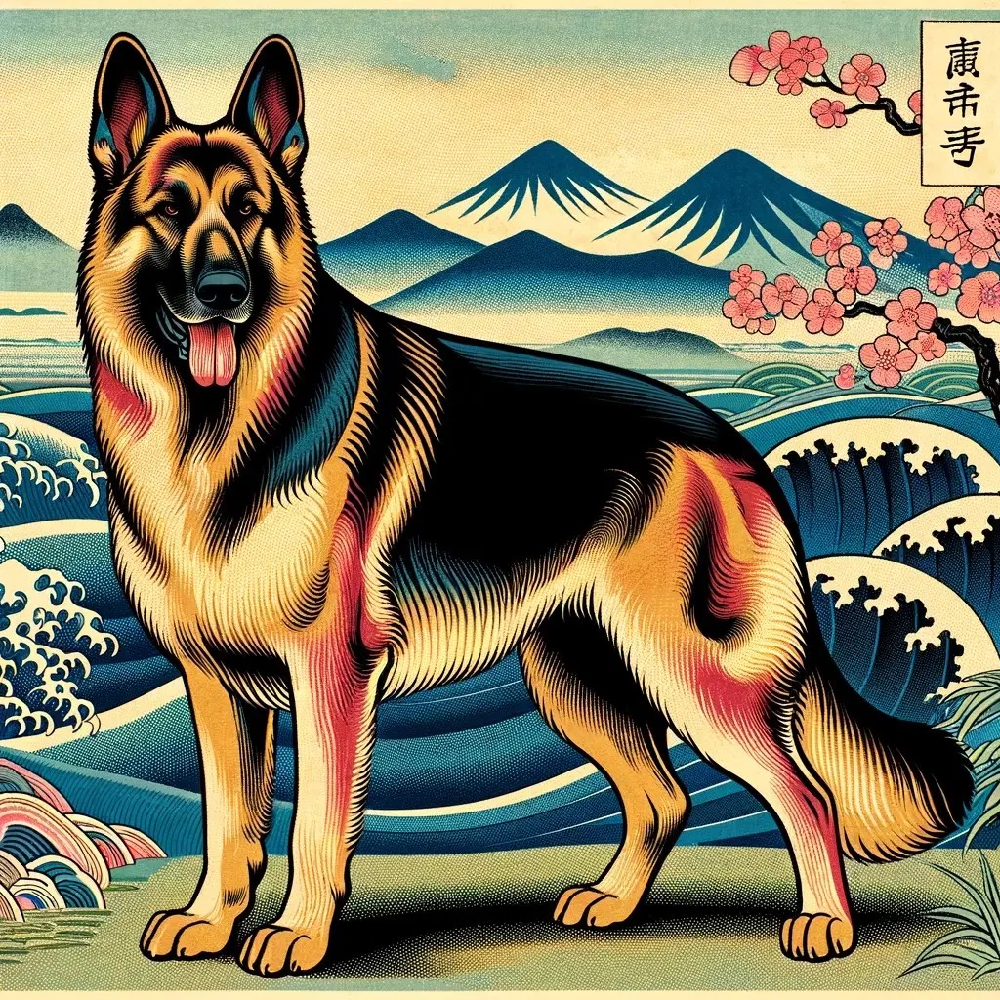

星战系列中帝国的士兵被称为风暴兵，是帝国的最基本武装。二战时期纳粹的武装部队最初被称为冲锋队（后被党卫军代替)。第一次世界大战中的德国帝国军队中的特种部队，被称为“突击兵”。这些突击兵在战场上执行难度较高的攻击任务，特别是在战壕战中。他们接受了特殊训练，以提高在复杂战场环境中的突破能力。

有意思的是，这三种不同的部队共同拥有同样的英文名称“Stormtrooper”。星战中的Stormtrooper本源就是英文。而另外两只部队的名称来自同一个德文单词Sturmabteilung的英文翻译。

所以说，如果不阅读原文，我们可能永远意识不到它们之间会有内在的联系。George Lucas在创作星战系列的时候，选择使用这个名称是有特殊含义的。纳粹党在给冲锋队起名字的时候，也是有其历史期待的。